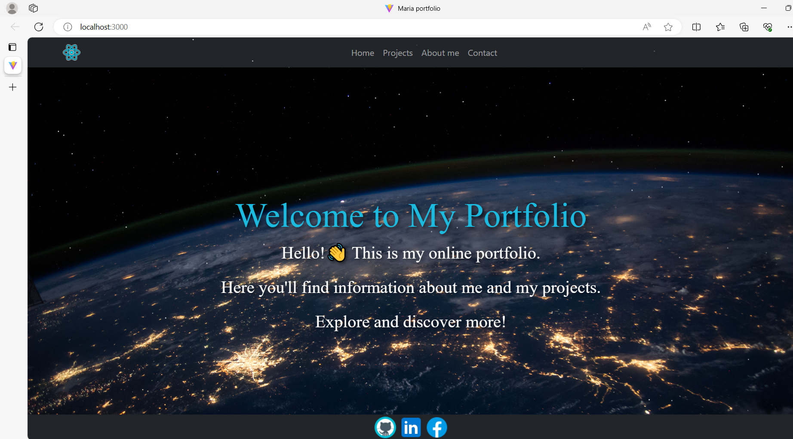
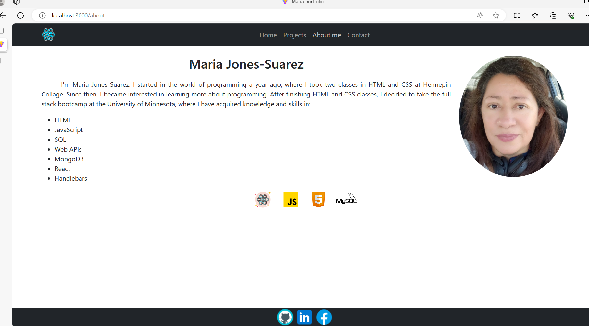

# 20 React: React Portfolio

my first portfolio using React.

## Description 

In this portfolio you will find four sessions that are:
Home: welcoming you to my portfolio.
projects: It will show the projects that I have developed during the bootcamp
about me: a short summary about me.
contact: this session is for you to communicate with me.
Finally, this portfolio you can see my repository by clicking on the github logo found in the footer

## Web page

This is my portfolio[ CLICK](https://maria-jones.netlify.app/)

## Screenshot

## Repository

Mi repository [Here](https://github.com/Pilar1936)
